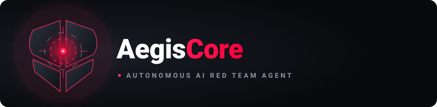
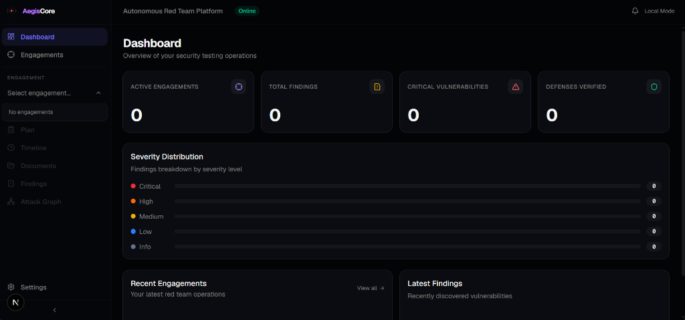

[](README.md)
[](README_KO.md)

<div align="center">
  
</div>

<h1 align="center">Aegiscore — Autonomous Red Team Agent</h1>

<p align="center"><i>"Another AI hacker? Let us guess — it runs nmap and writes a report."</i></p>

<div align="center">

<a href="https://github.com/karishmaram-tech/AegisCore/blob/main/LICENSE">
  
</a>
<a href="https://github.com/karishmaram-tech/AegisCore/stargazers">
  
</a>
<a href="https://github.com/karishmaram-tech/AegisCore/graphs/contributors">
  
</a>


</div>

<br/>

<div align="center">
  <em>Demo video coming soon — recording in progress.</em>
</div>


## Install

For installation and local development instructions, see [CONTRIBUTING.md](CONTRIBUTING.md).

→ **[Quick start](docs/getting-started.md)** · **[Full setup walkthrough](docs/setup-guide.md)**

### Use as a library (pip)

Building on top of the agents — a product, a research integration, or a custom orchestrator? Install the SDK from PyPI:

```bash
pip install aegiscore              # core SDK
pip install "aegiscore[neo4j]"     # + the knowledge-graph attack-chain tools
```

`aegiscore` is a **client SDK**: it ships the agent factories, middleware, tools, and skills, and routes LLM calls and sandbox execution to runtime services over HTTP (`DECEPTICON_LLM__PROXY_URL`, `SANDBOX_URL`). Running agents still needs those services — use the Docker stack above, or point the URLs at your own equivalents. See **[Aegiscore as a library](docs/library-usage.md)** for the factory override surface, declarative `PluginBundle` plugins, and the safety gate.


---

## Benchmark

*Benchmark results coming soon — once we've run our own evaluation suite against AegisCore.*

---

## What is Aegiscore?

The "AI + hacking" space is full of demos that run nmap and print a report. That's not what this is.

**Aegiscore is a professional autonomous Red Team agent.** It executes realistic attack chains — reconnaissance, exploitation, privilege escalation, lateral movement, C2 — the way a real adversary would, not the way a scanner does.

But more importantly: it operates under the discipline that separates red teamers from script kiddies. Before a single packet leaves the wire, Aegiscore generates a complete engagement package — **RoE**, **ConOps**, **Deconfliction Plan**, and **OPPLAN** with MITRE ATT&CK mapping — and every action runs inside those defined rules.

→ **[Engagement workflow deep dive](docs/engagement-workflow.md)**

---

## Why Aegiscore?

**Real kill chains, not checkbox scans.** Aegiscore reads an OPPLAN and pursues objectives through whatever path opens up — pivoting, adapting, chaining techniques.

**Interactive shells, actually.** Real offensive tools are interactive (`msfconsole`, `sliver-client`, `evil-winrm`). Aegiscore runs every command inside persistent tmux sessions with automatic prompt detection — so when a tool drops into an interactive prompt, the agent sends follow-up commands without workarounds.

**Hardened sandbox isolation.** All commands run inside a Kali Linux sandbox on a dedicated operational network (`sandbox-net`), separate from the management plane (`aegiscore-net`). LangGraph drives the sandbox via the Docker socket. → **[Architecture](docs/architecture.md)**

**Offense serves defense.** The planned [Offensive Vaccine](docs/offensive-vaccine.md) loop will turn findings into defense improvements through an attack → defend → verify cycle.

---

## Architecture

<div align="center">
  
</div>

Two-network design. The **always-on** management plane (LiteLLM, PostgreSQL, Skillogy, LangGraph) and the always-on sandbox plane stay up across the whole engagement; everything else is **dynamic-spawn** — the Web dashboard comes up on `/web` from the CLI, and specialist workloads (BloodHound CE, Sliver C2, Ghidra MCP, …) come up only when the orchestrator calls `ops_start(...)` (see [ADR-0006](docs/adr/0006-agent-driven-container-lifecycle.md)). Networks: management on `aegiscore-net`; sandbox + C2 server + targets on `sandbox-net`. Neo4j is dual-homed so the agent (on management) can persist findings written from inside the sandbox.

→ **[Architecture deep dive](docs/architecture.md)** · **[Knowledge graph](docs/knowledge-graph.md)**

---

## Agents

16 specialist agents organized by kill chain phase, with a fresh context window per objective — no accumulated noise.

Orchestration · Reconnaissance · Exploitation · Post-Exploitation · Vulnerability Research · Domain Specialists (AD, Cloud, Smart Contracts, Reversing, Analyst).

→ **[Full agent roster and middleware stack](docs/agents.md)**

---

## Models & Providers

Tier-based, credentials-aware fallback chain. You declare which credentials you have in priority order; Aegiscore builds the primary→fallback chain at every tier from there.

| Profile | Tier per agent | Use case |
|---------|----------------|----------|
| **eco** (default) | Per-agent (HIGH for orchestrator/exploiter/patcher/analyst, MID for execution, LOW for recon/soundwave) | Production |
| **max** | Every agent on HIGH | High-value targets |
| **test** | Every agent on LOW | Development / CI |

**Tier-mapped providers**: Anthropic, OpenAI, Google Gemini, MiniMax, DeepSeek, xAI, Mistral, OpenRouter, Nvidia NIM, Ollama (local).
**Subscription OAuth**: Claude Max/Pro/Team, ChatGPT Pro/Plus/Team, Gemini Advanced, Copilot Pro, SuperGrok, Perplexity Pro.

Configure via `aegiscore onboard`. → **[Full model reference & fallback examples](docs/models.md)**

---

## Documentation

| Topic | Doc |
|-------|-----|
| Installation and first engagement | [Getting Started](docs/getting-started.md) |
| Complete setup, OAuth, providers, dashboard | [Setup Guide](docs/setup-guide.md) |
| All CLI commands and keyboard shortcuts | [CLI Reference](docs/cli-reference.md) |
| All `make` targets | [Makefile Reference](docs/makefile-reference.md) |
| Agent roster and middleware | [Agents](docs/agents.md) |
| Model profiles and fallback chain | [Models](docs/models.md) |
| Skill system and format spec | [Skills](docs/skills.md) |
| Web dashboard features and setup | [Web Dashboard](docs/web-dashboard.md) |
| System architecture and network isolation | [Architecture](docs/architecture.md) |
| Neo4j knowledge graph | [Knowledge Graph](docs/knowledge-graph.md) |
| End-to-end engagement workflow | [Engagement Workflow](docs/engagement-workflow.md) |
| Offensive Vaccine loop | [Offensive Vaccine](docs/offensive-vaccine.md) |
| Contributing to Aegiscore | [Contributing](docs/contributing.md) |

---

## Contributing

```bash
git clone https://github.com/karishmaram-tech/AegisCore.git
cd Aegiscore
make dogfood  # Full OSS UX (launcher → onboard → CLI) on local code
make dev      # Backend hot-reload (compose watch) — daily dev loop
```

→ **[Contributing guide](docs/contributing.md)**


---

## Disclaimer

Do not use this project on any system or network without explicit written authorization from the system owner. Unauthorized access to computer systems is illegal. You are solely responsible for your actions. The authors and contributors assume no liability for misuse.

---

## License

[Apache-2.0](LICENSE)

---

<div align="center">
  
</div>
